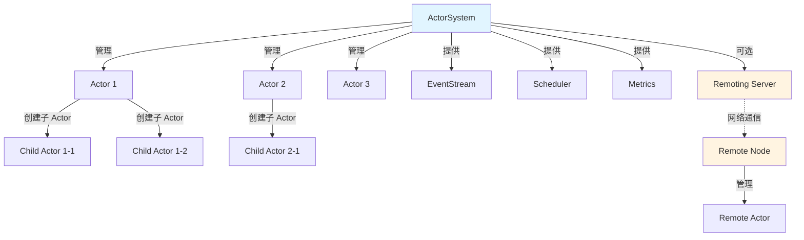
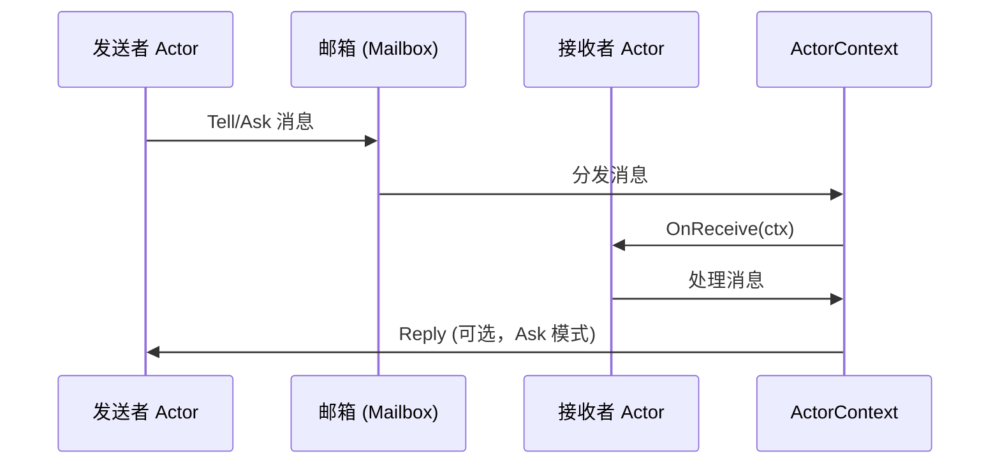

[](https://pkg.go.dev/github.com/kercylan98/vivid)
[](https://opensource.org/licenses/MIT)
[](https://golang.org)
[](https://goreportcard.com/report/github.com/kercylan98/vivid)
[](https://github.com/kercylan98/vivid/releases)
[](https://github.com/kercylan98/vivid)

**Vivid** 是高性能、类型安全的 Go Actor 模型库，提供完整 Actor 系统、消息传递、远程通信与监督策略，用于构建可扩展、高并发的分布式应用。

> **注意**：项目处于活跃开发阶段，API 可能变更。生产使用前请查看 [更新日志](https://github.com/kercylan98/vivid/releases)。

## 目录

- [特性](#特性)
- [系统要求与安装](#系统要求与安装)
- [架构概览](#架构概览)
- [应用场景](#应用场景)
- [文档与 Wiki](#文档与-wiki)
- [版本兼容性](#版本兼容性)
- [安全与贡献](#安全与贡献)
- [许可证与资源](#许可证与资源)

## 特性

- **完整 Actor 模型**：Actor 系统、上下文、引用，Tell/Ask 与 PipeTo
- **网络透明投递**：通过 ActorRef 统一寻址，本地/远程自动路由
- **远程通信**：内置 Remoting，跨节点 Actor 通信
- **监督策略**：OneForOne/OneForAll，重启、停止、恢复、升级
- **调度**：Once、Loop、Cron 等
- **行为栈与暂存**：Stash/Unstash、行为切换，适合状态机
- **生命周期与监控**：生命周期钩子、Watch/Unwatch、Metrics、事件流
- **可扩展**：自定义邮箱、类型安全消息、错误链

## 系统要求与安装

- **Go**：1.26+
- **安装**：

```bash
go get github.com/kercylan98/vivid
```

核心依赖：`github.com/google/uuid`、`github.com/reugn/go-quartz`、`golang.org/x/sync`（测试含 `testify`）。

## 架构概览

### Actor 系统



### 消息传递



## 应用场景

- 分布式系统、高并发服务、微服务间通信
- 状态机、事件驱动、定时/周期/Cron 任务、容错与自动恢复

## 文档与 Wiki

| 资源 | 链接 |
|------|------|
| **Wiki** | [https://kercylan98.github.io/vivid/](https://kercylan98.github.io/vivid/) |
| **API 文档** | [pkg.go.dev](https://pkg.go.dev/github.com/kercylan98/vivid) |
| **更新日志** | [Releases](https://github.com/kercylan98/vivid/releases) |

## 版本兼容性

自 **1.0.0** 起遵循 [语义化版本](https://semver.org/lang/zh-CN/)：MAJOR 为不兼容变更，MINOR 为兼容新增，PATCH 为兼容修复。1.0.0 之前不保证兼容性。

## 安全与贡献

- **安全**：请通过 [GitHub Security Advisories](https://github.com/kercylan98/vivid/security/advisories) 报告漏洞；非敏感问题可提 Issue。
- **贡献**：Fork → 特性分支 → 提交（建议 [Conventional Commits](https://www.conventionalcommits.org/)）→ 发起 PR。请保持测试通过（`go test ./...`）与代码规范。

## 许可证与资源

- **许可证**：[MIT](LICENSE)
- [Actor 模型 (Wikipedia)](https://en.wikipedia.org/wiki/Actor_model) · [原始论文](https://www.ijcai.org/Proceedings/73/Papers/027B.pdf)
