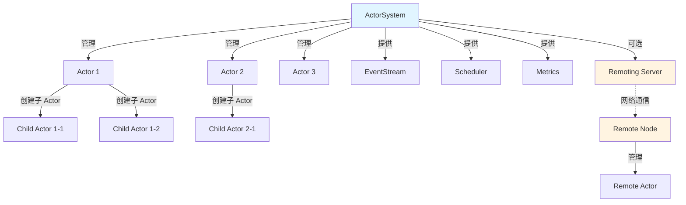
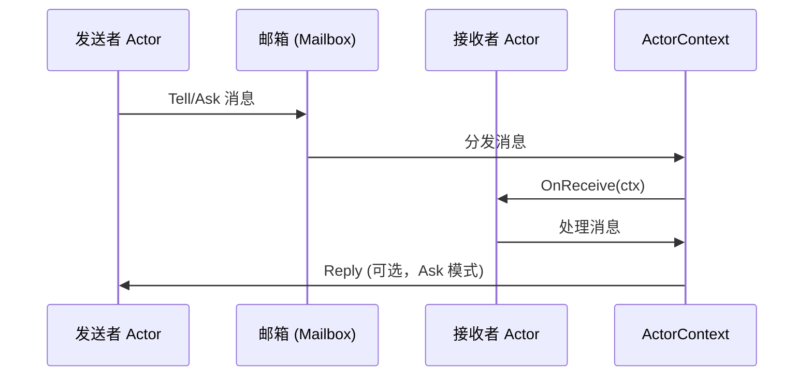

<div align="center">
  
  
  # Vivid
</div>

[](https://pkg.go.dev/github.com/kercylan98/vivid)
[](https://opensource.org/licenses/MIT)
[](https://golang.org)
[](https://goreportcard.com/report/github.com/kercylan98/vivid)

[](https://github.com/kercylan98/vivid/releases)
[](https://github.com/kercylan98/vivid)
[](https://github.com/kercylan98/vivid/issues)
[](https://github.com/kercylan98/vivid/pulls)

Vivid 是一个高性能、类型安全的 Go 语言 Actor 模型实现库，提供了完整的 Actor 系统、消息传递、远程通信、监督策略等核心功能，帮助开发者构建可扩展、高并发的分布式应用。

> **注意**：本项目目前处于活跃开发阶段，API 可能发生变更。建议在生产环境使用前查看 [更新日志](https://github.com/kercylan98/vivid/releases) 了解最新变更。

## 目录

- [特性](#特性)
- [系统要求](#系统要求)
- [安装](#安装)
- [架构概览](#架构概览)
- [应用场景](#应用场景)
- [文档](#文档)
- [版本兼容性](#版本兼容性)
- [安全](#安全)
- [贡献](#贡献)
- [许可证](#许可证)
- [相关资源](#相关资源)

## 特性

- **完整的 Actor 模型实现**：提供 Actor 系统、Actor 上下文、Actor 引用等核心抽象
- **灵活的消息传递**：支持 Tell（Fire-and-Forget）和 Ask（Request-Response）两种消息模式，以及消息管道（PipeTo）功能
- **消息投递网络透明**：通过 ActorRef 发送消息，无论目标 Actor 在本地还是远程节点，都能自动路由，实现网络透明的消息投递
- **远程通信支持**：内置 Remoting 功能，支持跨网络节点的 Actor 通信
- **监督策略**：提供完善的错误处理和恢复机制，支持一对一（OneForOne）和一对多（OneForAll）监督策略，包括重启、停止、恢复、升级等决策
- **调度功能**：内置调度器（Scheduler），支持定时（Once）、周期性（Loop）、Cron 表达式等多种调度方式
- **消息暂存**：支持消息暂存（Stash）和恢复（Unstash）功能，适用于条件未满足时的消息缓冲场景
- **行为栈管理**：支持 Actor 行为动态切换和恢复，实现状态机模式
- **生命周期管理**：完整的 Actor 生命周期钩子（启动前、重启前、重启后等），支持监听其他 Actor 的终止事件（Watch/Unwatch）
- **指标收集**：内置 Metrics 支持，可监控系统运行状态
- **事件流**：提供事件流机制，支持系统级事件订阅和发布
- **可扩展邮箱**：支持自定义邮箱实现，满足不同调度需求
- **错误处理**：增强的错误类型，支持错误链和标准 error 处理
- **类型安全**：充分利用 Go 的类型系统，提供类型安全的消息传递

## 系统要求

- **Go 版本**：1.25.1 或更高版本
- **操作系统**：支持所有 Go 支持的操作系统（Linux、macOS、Windows 等）
- **架构**：支持所有 Go 支持的 CPU 架构（amd64、arm64、386 等）

## 安装

使用 Go 模块管理工具安装：

```bash
go get github.com/kercylan98/vivid
```

### 依赖说明

Vivid 的核心依赖保持最小化，主要包括：

- `github.com/google/uuid` - UUID 生成
- `github.com/reugn/go-quartz` - 调度器实现
- `golang.org/x/sync` - 同步原语扩展
- `github.com/stretchr/testify` - 测试工具（仅开发依赖）

所有依赖均经过严格筛选，确保稳定性和安全性。

## 应用场景

Vivid 适用于以下场景：

- **分布式系统**：构建跨网络节点的分布式应用，利用网络透明的消息投递能力
- **高并发服务**：处理大量并发请求，通过 Actor 模型实现线程安全的并发处理
- **微服务架构**：作为微服务间通信的基础设施，提供可靠的异步消息传递
- **状态机实现**：通过行为栈管理实现复杂的状态机模式
- **事件驱动系统**：利用事件流机制构建松耦合的事件驱动架构
- **定时任务调度**：使用内置调度器实现定时任务、周期性任务和 Cron 任务
- **容错系统**：通过监督策略构建具有自动恢复能力的容错系统

## 文档

- **API 文档**：完整的 API 文档请访问 [pkg.go.dev](https://pkg.go.dev/github.com/kercylan98/vivid)
- **Wiki 文档**：详细的使用指南和最佳实践请参考 [Wiki 站点](https://github.com/kercylan98/vivid/wiki)（建设中）
- [更新日志](https://github.com/kercylan98/vivid/releases)

## 许可证

本项目采用 [MIT 许可证](LICENSE)。详情请参阅 [LICENSE](LICENSE) 文件。

## 状态

- **开发状态**：活跃开发中
- **稳定性**：API 可能发生变更
- **测试覆盖率**：持续提升中
- **文档**：API 文档完整，Wiki 文档建设中

## 版本兼容性

Vivid 遵循 [语义化版本控制](https://semver.org/lang/zh-CN/)：

- **主版本号（MAJOR）**：不兼容的 API 变更
- **次版本号（MINOR）**：向后兼容的功能新增
- **修订号（PATCH）**：向后兼容的问题修复

当前版本处于活跃开发阶段，API 可能发生变更。建议在生产环境使用前仔细阅读更新日志。

## 安全

如果您发现安全漏洞，请通过以下方式报告：

- **安全邮箱**：请通过 GitHub Security Advisories 报告安全问题
- **公开问题**：对于非敏感问题，可直接创建 GitHub Issue

我们会在收到报告后尽快响应并修复。

## 贡献

我们欢迎所有形式的贡献！在开始之前，请阅读以下指南：

### 贡献流程

1. Fork 本仓库
2. 创建特性分支（`git checkout -b feature/amazing-feature`）
3. 提交更改（`git commit -m 'Add some amazing feature'`）
4. 推送到分支（`git push origin feature/amazing-feature`）
5. 开启 Pull Request

### 代码规范

- 遵循 Go 官方代码规范
- 确保所有测试通过（`go test ./...`）
- 添加必要的测试用例和文档注释
- 保持代码简洁和可读性

### 提交规范

提交信息应遵循 [Conventional Commits](https://www.conventionalcommits.org/) 规范：

- `feat:` 新功能
- `fix:` 问题修复
- `docs:` 文档更新
- `refactor:` 代码重构
- `test:` 测试相关
- `chore:` 构建/工具相关

## 架构概览

### Actor 系统架构



### 消息传递流程



## 相关资源

- [Actor 模型 (Wikipedia)](https://en.wikipedia.org/wiki/Actor_model) - Actor 模型的计算机科学理论
- [Actor 模型论文](https://www.ijcai.org/Proceedings/73/Papers/027B.pdf) - Carl Hewitt 的原始论文